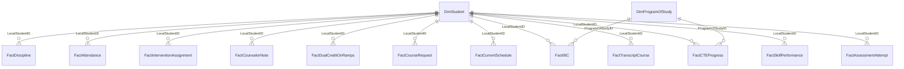

# Relationship diagram

```mermaid
erDiagram
  DimStudent ||--o{ FactAssessmentAttempt : LocalStudentID
  DimStudent ||--o{ FactSkillPerformance : LocalStudentID
  DimStudent ||--o{ FactTranscriptCourse : LocalStudentID
  DimStudent ||--o{ FactCurrentSchedule : LocalStudentID
  DimStudent ||--o{ FactCourseRequest : LocalStudentID
  DimStudent ||--o{ FactCTEProgress : LocalStudentID
  DimStudent ||--o{ FactIBC : LocalStudentID
  DimStudent ||--o{ FactDualCreditOnRamps : LocalStudentID
  DimStudent ||--o{ FactCounselorNote : LocalStudentID
  DimStudent ||--o{ FactInterventionAssignment : LocalStudentID
  DimStudent ||--o{ FactAttendance : LocalStudentID
  DimStudent ||--o{ FactDiscipline : LocalStudentID
  DimProgramOfStudy ||--o{ FactCTEProgress : ProgramOfStudyID
  DimProgramOfStudy ||--o{ FactIBC : ProgramOfStudyID
```
